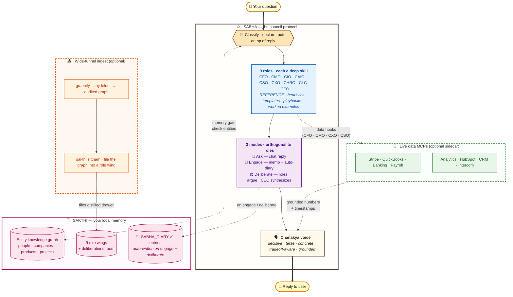

# Architecture

How Sabha OS, Sakthi Graph, and the corpus-ingest verb compose into one local-first stack.

This page is for: developers wanting to understand the data flow, contributors deciding where a new feature belongs, and operators evaluating whether the stack matches their threat model.

---

## The 30-second view



> **Reading the diagram:** thick arrows (==>) are the request/response path. Dotted arrows are the loops — Sabha reads from Sakthi before answering (memory gate · entity check), writes back on engage and deliberate (decisions compound), and reaches sideways into data MCPs when a role needs live numbers. The graphify → sittham branch is an optional ingest path: bring any folder (code, docs, papers, transcripts) into the right Sakthi role wing in one command. Everything in the diagram runs on your machine; only the LLM call itself crosses the boundary.

The diagram has four boxes and one direction of compounding:

- **Sabha OS** (the council) — the routing protocol. Every substantive question gets classified to a role, run through a mode, and answered in Chanakya voice. New in v2.2.0: `deliberate` and `sakthi-diary` mode skills.
- **Sakthi Graph** (your memory) — the durable, role-shaped retrieval surface. A local ChromaDB-backed knowledge graph with 9 Sabha role wings + a deliberations room. Diary entries auto-write on engage/deliberate; the entity graph is read on every memory gate.
- **Data MCPs** (sidecar, optional) — live grounding so CFO can quote actual Stripe MRR, CMO can quote actual Google Analytics, CSO can quote actual CRM pipeline. Roles document their hooks under `skills/roles/<role>/data-hooks/`.
- **graphify + sittham** (ingest path, optional) — wide-funnel ingest. `graphify` turns any folder into an audited knowledge graph (EXTRACTED / INFERRED / AMBIGUOUS edges); `sakthi sittham` files the distillation into the right role wing. `sittham` (சித்தம், Tamil for *consciousness / awareness*) is the verb that bridges layer 1 (graphify) and layer 2 (Sakthi).

---

## The naming, complete

| Term | Tamil / Sanskrit | Meaning | Role in the stack |
|---|---|---|---|
| **Sabha** | சபை / सभा | council | the routing protocol |
| **Chanakya** | சாணக்கியர் / चाणक्य | the strategist | the voice / archetype |
| **Sakthi** | சக்தி / शक्ति | power | the memory |
| **Sittham** | சித்தம் / चित्त (chitta) | consciousness | the corpus-ingest verb |

The metaphor lands cleanly: Sakthi is the *power* (the accumulated capacity); Sittham is the *consciousness* (what that capacity holds in mind). `sakthi sittham <folder>` reads literally as "bring this folder into Sakthi's consciousness."

---

## Full diagram

```
┌────────────────────────────────────────────────────────────────────────────┐
│                          YOUR MACHINE                                       │
│                 local-first  ·  nothing leaves                              │
└────────────────────────────────────────────────────────────────────────────┘

  ─── INGEST PATH ───────────────────────────────────────────────────────────

      ANY FOLDER                                       /graphify <path>
      ──────────                                       ┌──────────────┐
      code · docs · papers · screenshots ───►   ──────►│  AST + LLM   │
      transcripts · /raw                               │  extraction  │
                                                       │  community   │
                                                       │  detection   │
                                                       └──────┬───────┘
                                                              │
                                                              ▼
                                               graphify-out/
                                               ├ GRAPH_REPORT.md
                                               ├ graph.json
                                               └ graph.html
                                                              │
                      sakthi sittham <path>      ◄────────────┘
                      ──────────────────────
                      1. score corpus against 9 role vocabularies
                      2. pick wing  (or ceo/synthesis-notes on weak signal)
                      3. compose drawer
                         (counts · god nodes · signal · excerpt)
                      4. tool_add_drawer()
                         (idempotent on (wing, room, content))
                                                              │
  ─── STORAGE: SAKTHI ───────────────────────────────────────  │ ────────────
                                                              ▼
  ╔════════════════════════════════════════════════════════════════════════╗
  ║   SAKTHI PALACE   ( ChromaDB · ~/sakthi · locally owned )              ║
  ║                                                                        ║
  ║   cfo/    ◄── runway · pricing · LTV · CAC · fundraise                 ║
  ║   cmo/    ◄── positioning · brand · channels · campaigns               ║
  ║   cio/    ◄── infra · vendors · incidents · security                   ║
  ║   caio/   ◄── LLM · RAG · evals · model selection                      ║
  ║   cso/    ◄── strategy · partnerships · big bets                       ║
  ║   cxo/    ◄── activation · retention · churn · NPS                     ║
  ║   chro/   ◄── hires · comp · classification · org                      ║
  ║   clc/    ◄── contracts · IP · privacy · regulatory                    ║
  ║   ceo/    ◄── synthesis · board · pivots · ambiguous corpora           ║
  ║                                                                        ║
  ║   Each wing's `decisions` room is the role's primary inbox.            ║
  ╚════════════════════════════════════════════════════════════════════════╝
                            ▲                              │
                            │ sakthi_diary_write           │ sakthi_search
                            │ (on engage + deliberate)     │ sakthi_kg_query
                            │ via sakthi-diary skill       │
                            │                              ▼
  ─── REASONING: SABHA ─────┴────────────────────────────────────────────────

  ╔════════════════════════════════════════════════════════════════════════╗
  ║   SABHA  ( the council  ·  the routing protocol )                      ║
  ║                                                                        ║
  ║   USER QUESTION ──► classify ──► declare route at top of reply         ║
  ║                                                                        ║
  ║      Routing: <ROLE> (primary). <other role> weighs in on <topic>.     ║
  ║                                                                        ║
  ║   ┌──────────┬──────────┬──────────┬──────────┬──────────┐             ║
  ║   │   CFO    │   CMO    │   CIO    │  CAIO    │   CSO    │             ║
  ║   ├──────────┼──────────┼──────────┼──────────┼──────────┤             ║
  ║   │   CXO    │  CHRO    │   CLC    │   CEO    │          │             ║
  ║   └──────────┴──────────┴──────────┴──────────┴──────────┘             ║
  ║                                                                        ║
  ║   each role = deep skill: REFERENCE · heuristics · templates ·         ║
  ║                playbooks · worked examples · references                ║
  ║                                                                        ║
  ║   answer in Chanakya voice:                                            ║
  ║     · decisive  ( recommend; don't survey )                            ║
  ║     · terse     ( no padding, no windups )                             ║
  ║     · concrete  ( real vendors, dollars, file paths )                  ║
  ║     · tradeoff  ( "Do X. You lose Y. Worth it because Z." )            ║
  ║     · grounded  ( cite source · mark estimate · never invent )         ║
  ╚════════════════════════════════════════════════════════════════════════╝
                            │
                            ▼
                      REPLY TO USER
                      + on engage:      SABHA_DIARY v1 entry  ►  compounds Sakthi
                      + on deliberate:  transcript + diary    ►  compounds Sakthi
```

---

## Layer-by-layer

### 1. graphify (wide-funnel ingest)

External tool, install with `pip install graphifyy`. Invoked as `/graphify <path>` inside Claude Code, or as the `graphify` CLI directly.

What it does:
- **AST extraction** for code (deterministic, free).
- **LLM-based semantic extraction** for docs / papers / images (community detection via Louvain or Leiden).
- **Edge auditing** — every relationship tagged EXTRACTED (explicit in source), INFERRED (reasonable inference), or AMBIGUOUS (uncertain, flagged for review).
- Outputs to `<project>/graphify-out/{GRAPH_REPORT.md, graph.json, graph.html}`.

Graphify is *external* to the Sabha trinity but plays well with it. The graph stays at the project; Sakthi never holds the full graph, only a distillation drawer.

### 2. Sakthi Graph (durable retrieval)

A fork of [MemPalace](https://github.com/MemPalace/mempalace) with Sabha-specific presets. ChromaDB-backed; ~300MB embedding model; runs locally.

Install: `uv tool install sakthi-graph` (or `pip install sakthi-graph`).

Bootstrap: `sakthi init --sabha ~/sakthi` creates 9 role wings.

Key concepts:
- **Wing** — top-level category (one per Sabha role: cfo, cmo, cio, caio, cso, cxo, chro, clc, ceo).
- **Room** — subdivision inside a wing (every wing has `decisions` as its primary inbox).
- **Drawer** — a unit of content (a decision, a memo, a corpus summary). Identified by `drawer_{wing}_{room}_{sha256(wing+room+content)[:24]}` — idempotent on content.
- **Diary entries** — role-keyed entries written at the end of an engage session.

MCP surface (32 tools total) covers status, knowledge-graph CRUD, drawer CRUD, search, diary, traversal, tunnels, and corpus ingest. See [`sakthi-graph/README.md`](https://github.com/rdmurugan/sakthi-graph) for the full tool list.

### 3. `sakthi sittham` (the bridge)

The verb that moves a graphify corpus into Sakthi. Three surfaces, one function:

| Surface | Use when |
|---|---|
| MCP tool `sakthi_sittham` | An agent (e.g., Sabha itself) wants to file a corpus mid-conversation. |
| CLI `sakthi sittham <path>` | You're running a one-off ingest from your terminal. |
| Python `mempalace.sittham.sittham(path)` | You're scripting around it. |

What it does:
1. Read `<path>/graphify-out/{GRAPH_REPORT.md, graph.json}`.
2. Score the corpus against the 9 Sabha role vocabularies (substring match against node names, labels, community names, edge types, report headings).
3. Pick the dominant role (top score must be ≥ 3 AND beat runner-up by ≥ 2; otherwise fall back to `ceo/synthesis-notes`).
4. Compose a compact summary drawer: counts, top god nodes, role-signal breakdown, report excerpt, path back to the full graph.
5. File via `tool_add_drawer` — idempotent on `(wing, room, content)`.

No LLM call. Pure keyword scoring. ~190 LOC, 7 unit tests.

### 4. Sabha OS (the council)

The protocol layer. Lives in one file: [`CLAUDE.md`](../CLAUDE.md), with deep skills under `skills/roles/<role>/` and orthogonal mode skills under `skills/modes/<mode>/`.

For every substantive question:
1. **Classify** to one (or two) of the 9 roles. Declare at the top of the reply.
2. **Check Sakthi** for facts about known entities before asserting. (`sakthi_search`, `sakthi_kg_query`.)
3. **Load the deep skill** for the routed role (REFERENCE + heuristics + templates + playbooks).
4. **Answer in Chanakya voice** — decisive, terse, concrete, tradeoff-aware, grounded.
5. **On engage mode**, produce a file (`.docx` for formal exec reports, `.md` for everything else) AND write a `SABHA_DIARY v1` entry to Sakthi via the [`sakthi-diary`](../skills/modes/sakthi-diary/SKILL.md) skill so the decision compounds.
6. **On deliberate mode**, run the [`deliberate`](../skills/modes/deliberate/SKILL.md) protocol — 2-3 roles open, rebut, CEO synthesizes — and auto-write a diary entry with the full transcript in the `transcript` field.

The protocol skips chit-chat, trivia, and meta-questions about Sabha itself.

### 5. Mode skills (orthogonal to roles)

Roles answer the *who*. Mode skills answer the *how*. Roles and modes compose: a CFO answer in engage mode produces a CFO memo + a CFO-keyed diary entry; a CFO↔CSO answer in deliberate mode produces a transcript + a council-keyed diary entry.

Current mode skills:

| Skill | Path | Purpose |
|---|---|---|
| `deliberate` | `skills/modes/deliberate/` | Fixed multi-role protocol with strict section scaffolds; auto-diary at end |
| `sakthi-diary` | `skills/modes/sakthi-diary/` | Canonical `SABHA_DIARY v1` template + backend transport table for memory writes |

Mode skills are activation-driven, not always-loaded. The router brings them in when their activation conditions fire (`/deliberate`, `/engage`, "file this," "let the council weigh in"). This keeps the per-reply token cost low for the common ask-mode case.

---

## Data MCP integration (real-time grounding)

Memory MCPs hold what the user told the council. **Data MCPs** hold what the user's *systems* know — live Stripe MRR, real QuickBooks expense breakdown, current Google Analytics funnel.

Deep-skilled roles document their data hooks per-MCP under `skills/roles/<role>/data-hooks/`:

- **CFO** — Stripe, QuickBooks, banking, payroll.
- **CMO** — Google Analytics, HubSpot, Intercom, ad platforms.

Each data-hook doc covers: when to reach for it, tool-call shapes, grounding rules specific to that data source, anti-patterns, worked example.

Grounding discipline still applies (§3 of CLAUDE.md): numbers pulled from data MCPs are cited with source + timestamp. *"Per Stripe (last 30d collected, as of 2026-05-14 09:00 UTC), net MRR is $32,400."*

Sabha stays MCP-agnostic at the protocol layer — it describes the *shape* of integration, not which Stripe MCP to use.

---

## Threat model

Sabha is built local-first. The threat model is:

| Threat | Mitigation |
|---|---|
| Cloud LLM provider sees the question and reply | Out of scope — that's the cost of using a hosted LLM. Choose your provider accordingly. |
| Cloud LLM provider sees your accumulated knowledge | Mitigated — Sakthi lives on your machine; never uploaded to the LLM provider. Only the *snippets retrieved per query* enter the LLM context. |
| A future Sabha update exfiltrates Sakthi data | Mitigated — open source, MIT-licensed; you can pin a known-good version and audit the diff before upgrading. |
| Sakthi corpus contains data you don't want compounded | Don't `sittham` it. Or `sakthi delete-drawer` after the fact. |
| A teammate's machine contains different Sakthi state | Expected and acceptable — each person's Sakthi is their own. No sync, no central truth. |
| graphify's LLM-extraction step calls a cloud LLM | True — graphify can use the user's API key. Run graphify locally with a local model if this matters; or only ingest corpora that are OK to send to a cloud LLM. |

**What Sabha does not do:**
- It does not send telemetry. (Verifiable in the code.)
- It does not auto-update. (Plugin install is explicit.)
- It does not call home. (No network egress in the protocol layer.)
- It does not store data outside `~/sakthi` (or wherever you `--palace`-pointed it).

---

## File layout (the durable contract)

What changes vs. what stays:

| Stable contract | Implementation detail |
|---|---|
| `CLAUDE.md` schema (the 5 sections: CLASSIFY / MEMORY / ANSWER / MODE / SKIP) | The exact role list, wording |
| The 9-role taxonomy (cfo, cmo, cio, caio, cso, cxo, chro, clc, ceo) | The vocabulary inside each role's REFERENCE |
| `graphify-out/{GRAPH_REPORT.md, graph.json}` shape | graphify's internal schema for graph.json (versioned) |
| MCP tool names (`sakthi_*`) | Internal tool implementation in `mempalace/mcp_server.py` |
| Drawer ID formula `drawer_{wing}_{room}_{sha256[:24]}` | The hash algorithm (currently sha256) |
| MIT license | The fork relationship to upstream MemPalace |

When you customize, prefer changing the stable contract via `CLAUDE.md` rather than forking the internals.

---

## Where to make changes

| Goal | Touch |
|---|---|
| Rename roles or restructure the council | `CLAUDE.md` |
| Add domain knowledge to a role | `skills/roles/<role>/REFERENCE.md` |
| Add a new template/playbook to a role | `skills/roles/<role>/templates/` or `playbooks/` |
| Add a new data-MCP integration | `skills/roles/<role>/data-hooks/<vendor>.md` |
| Change how routing classifies a question | `skills/sabha-router/SKILL.md` + `CLAUDE.md` routing table |
| Add a new ingest source (not graphify) | New module in `sakthi-graph/mempalace/` + new MCP tool |
| Change the engage-mode output format | Engage section in `CLAUDE.md`; nothing in code to change |

---

## Related reading

- [`PHILOSOPHY.md`](./PHILOSOPHY.md) — why the protocol has these five disciplines
- [`ROLES.md`](./ROLES.md) — the 9 roles in detail
- [`CUSTOMIZATION.md`](./CUSTOMIZATION.md) — how to adapt the stack to your work
- [`EVALS.md`](./EVALS.md) — does it actually work
- [Sakthi Graph](https://github.com/rdmurugan/sakthi-graph) — the memory layer
- [MemPalace](https://github.com/MemPalace/mempalace) — the upstream fork source
